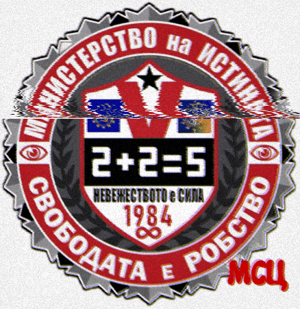
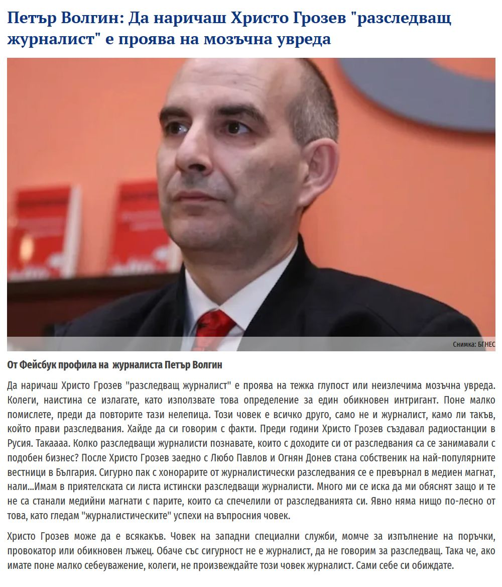

След публикуване на видео с цитат на вече действащ зам.-министър Шамандуров (възпитаник на СССР!) от същото служебно правителство, в което той брутално пренаписва историята с думите „Германия е победител във Втората световна война“, и след добавяне на неудобна гледна точка, страницата ми беше спряна.

Това не е „борба с дезинформацията“, а класически пример как неудобното мнение се наказва, а удобният абсурд се пази, и даже се толерира от "журнаГлиста" Крум Савов- нито дума като опровержение на фалшивата новина.

Съвпадение или симптом на среда, в която различното мнение и реалната истина все по-често се третира като „руска пропаганда“ и „дезинформация“?

Крадецът вика: дръжте крадеца.



  



Поводът за спирането дойде след качване на видео цитата във фейсбук, което вече присъства в раздела „Видеа“ на настоящия сайт и показва до каква степен може да се стигне в пренаписването на историята, когато политическата линия на слагачество към ГОСПОДАРИТЕ от КОЧИНАТА ЕгС е по-важна от истината.

По-късно ще добавя и още примери, защото това не е единичен случай, а модел, в който живеем от ерата в която главната гинеколожка на КОЧИНАТА ЕгС- Фюрерината Уруспия Фък Лайнен ни води към "светлото" цифрово бъдеще на **ДИКТАТУРАТА**.

